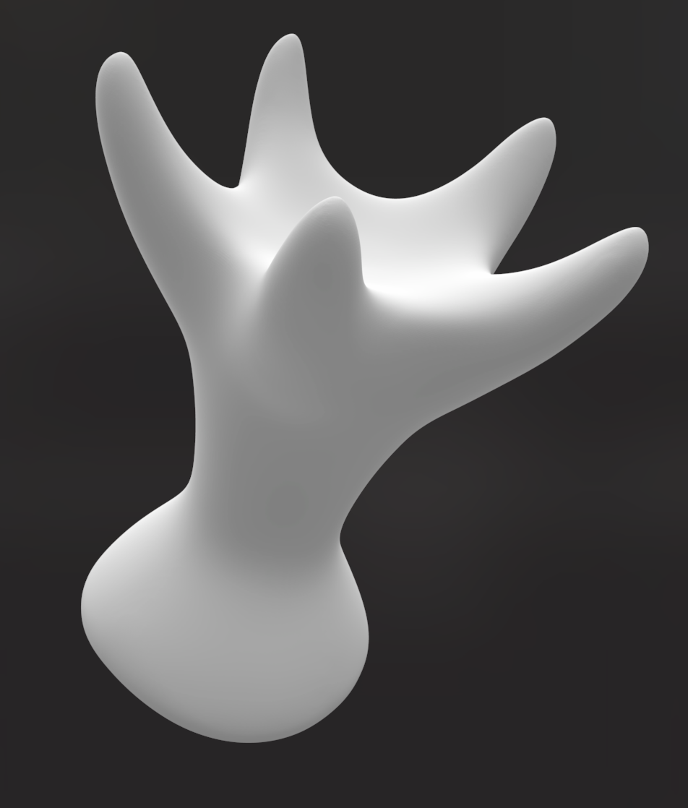
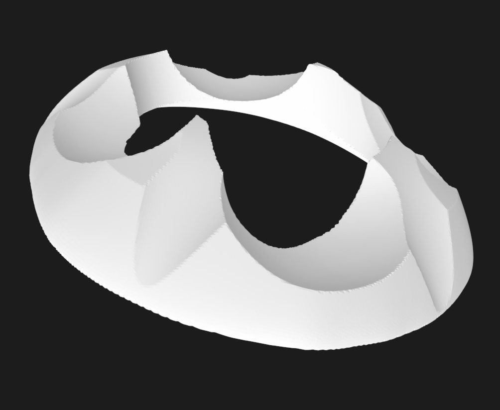
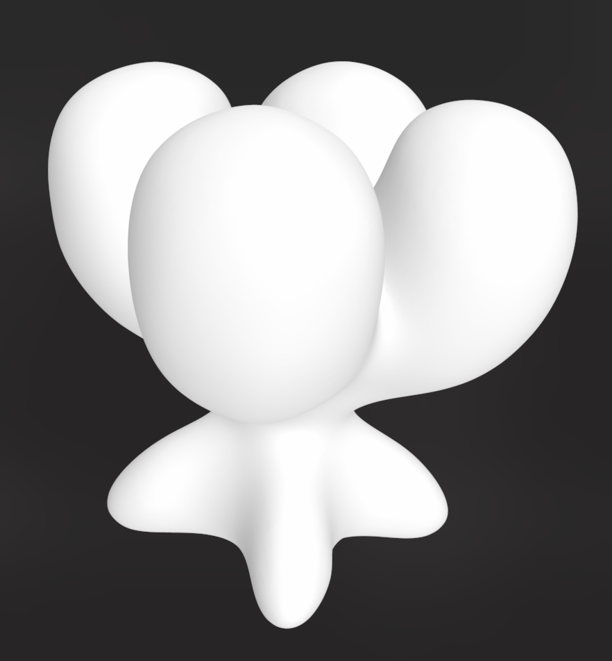
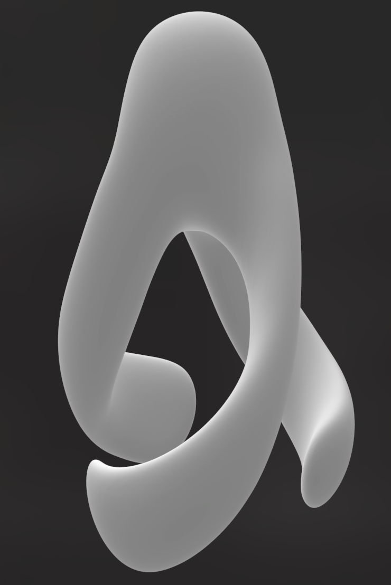

# Organism Models

## Eat

#### Dimensions (mm):

| Version | X    | Y   | Z   |
|---------|------|-----|-----|
| 00      |      |     |     |   
| 04      | 36.6 | 37  | 48  |
| 07      | 35.9 | 37  | 48  |
| 11      | 35.9 | 37  | 48  |

## Food

#### Dimensions (mm):

| Version | X    | Y    | Z    |
|---------|------|------|------|
| 00      |      |      |      |   
| 03      | 20   | 20   | 8    |
| 06      | 31.2 | 31.6 | 7.56 |
| 07      | 31.2 | 31.6 | 7.83 |
| 09      | 28.6 | 28.1 | 9.2  |
| 10      | 29.5 | 29.1 | 7.76 |
| 11      | 31   | 31   | 9.38 |
| 13      | 33.7 | 33.5 | 9.07 |
| 14      | 29.5 | 29.7 | 8.9  |
| 17      | 31.2 | 31   | 7.64 |
| 19      | 28.9 | 29.1 | 8.09 |

## Grow

#### Dimensions (mm):

| Version | X   | Y   | Z   |
|---------|-----|-----|-----|
| 00      |     |     |     |   
| 02      | 37  | 37  | 36  |
| 04      | 37  | 37  | 36  |

## Move

#### Dimensions (mm):

| Version | X   | Y   | Z   |
|---------|-----|-----|-----|
| 00      |     |     |     |   
| 02      | 37  | 37  | 60  |

## Printing Notes

MK3S+  
Smooth plate

Various PLAs ( extra adhesive very important )

**.20mm Quality** with the following changes

- Extra Perimeters if needed: True
- Detect Bridging Perimeters: True
- Infill: 50%
- Support Material above Plate only : True
- Avoid Crossing Perimeters: True
- Detect Thin Walls: True
- Detect bridging perimeters: True
- Seam Position: Aligned

